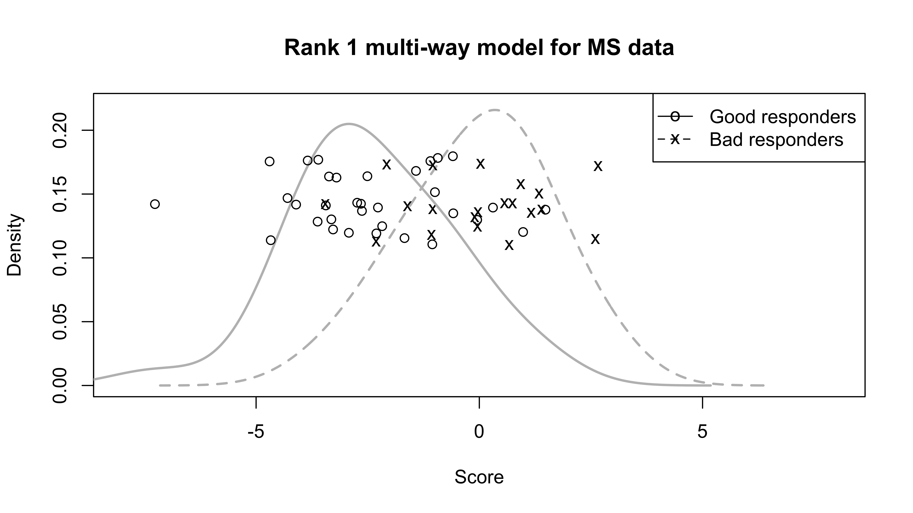
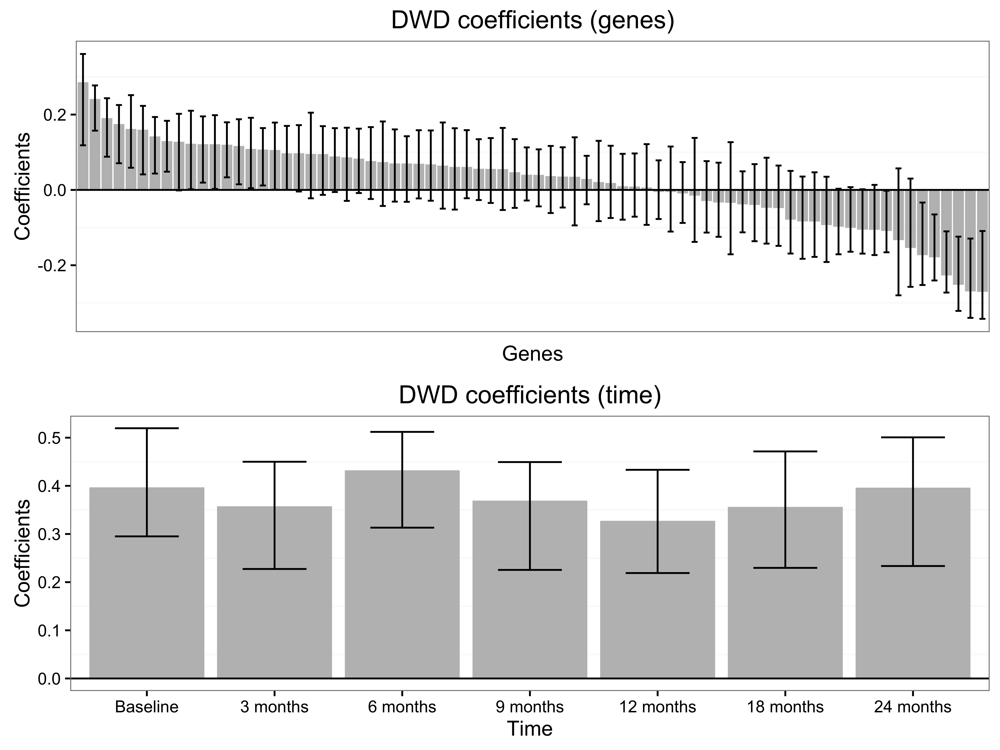

This vignette illustrates the use of the **MultiwayClassification** package, using publicly available data on gene time course data originally described in @baranzini2005. This package performs linear classification for data with multi-way structure. The distance-weighted discrimination (DWD) or support vector machine (SVM) classification objectives are optimized under the assumption that the multi-way coefficients have low rank. 

## Loading the data

First, if you have not done so already, install and load the package via GitHub.  This package depends on the packages **DWD** (for DWD) and **kernlab** (for SVM). DWD is not currently available on CRAN, and so will need to be installed via its url:
```
install.packages("https://cran.r-project.org/src/contrib/Archive/DWD/DWD_0.11.tar.gz",repos = NULL, type = "source")
library(DWD)
```
The **MultiwayClassification** package can then be installed, directly from GitHub, using the devtools library.
```
install.packages(devtools)
library(devtools)
install_github("lockEF/MultiwayClassification")
library(MultiwayClassification)
```
To load the gene time course data, enter   
```data(IFNB_Data)```   
These data are for patients with multiple sclerosis after treatment with IFNBeta. Patients are classified as good or poor responders. Gene expression was measured for 76 genes of interest before treatment (baseline) and at 6 follow-up time points over the next two years (3 months, 6 months, 9 months, 12 months, 18 months, 24 months). The original data has been log-normalized and mean-imputed.  The previous command loads the following variables:

* `DataArray`:  Time course array: 53 patients X 7 time points X 76 genes.
* `Class`: Vector giving patient classification as good or poor responders.

We will also define the following variables:

```n_times=7; n_genes=76; n_people=53```


##DWD classification and cross-validation
First, we apply standard DWD on the vectorized data (this corresponds to the full rank model).  Combine the data into a matrix in which each column gives gene expression for all time points for a given individual:

```
FullMat <- matrix(nrow=n_times*n_genes,ncol=n_people)
for(i in 1:n_people){
  FullMat[,i] =  as.vector(DataArray[i,,])
}
```
Now, use the `kdwd` function from package **DWD** to estimate the separating hyperplane:
```
results.full <- kdwd(x=t(FullMat),y=as.factor(Class), scaled=FALSE)
```
Compute scores for each subject under leave one out cross-validation:
```
cv.full = c()
for(i in 1:length(Class)){
  results.full.cv <- kdwd(t(FullMat[,-i]),y=as.factor(Class[-i]), scaled=FALSE)
  cv.full[i] = t(FullMat[,i]) %*%results.full.cv@w[[1]]+results.full.cv@b0[[1]]
}
```
Now, use the `mul.dwd` function to estimate the rank 1 multiway DWD model and compute the scores under leave-one-out cross validation: 
```
cv.mw = c()
for(i in 1:length(Class)){
  results.mw.cv <-mul.dwd(DataArray[-i,,],y=Class[-i],rank=1)
  cv.mw[i] = sum(DataArray[i,,]*results.mw.cv$beta)+results.mw.cv$int
}
```
Compare cross validation miss-classification rates for the full and rank 1 model:
```
miss.full <- sum(Class==1&cv.full<0 | Class==2&cv.full>0)/length(Class)  #22.6%
miss.mw <- sum(Class==1&(cv.mw+0.1)<0 | Class==2&(cv.mw+0.1)>0)/length(Class) #16.9%
```
Compare t-statistics under cross-validation between the full rank DWD and rank 1 model:
```
t.test(cv.mw[Class==1],cv.mw[Class==2])$statistic
t.test(cv.full[Class==1],cv.full[Class==2])$statistic 
```
By setting `rank=r` in the `mul.dwd` function, we can similarly compute the misclassification rate for other rank models.  

Finally, we plot the cross-validated scores for each class under the rank 1 multi-way model, using the package **ggplot2** for plotting and **ks** for kernel density estimates (these packages may need to be installed beforehand):
```
library("ggplot2")
library(ks)
png(filename = "TimeCourseScores_INFB.png",width=8,height=4.5,units='in',res=800)
plot(kde(cv.mw[Class==1],h=1),ylim = c(0,0.22), col='gray', xlim=c(-8,8),xlab = 'Score', ylab = 'Density', lty =2,lwd=2,main = 'Rank 1 multi-way model for MS data')
points(cv.mw[Class==1],runif(20,0.11,0.18),col='black', pch = 'x')
plot(kde(cv.mw[Class==2],h=1), col='gray', add=TRUE, lwd=2)
points(cv.mw[Class==2],runif(33,0.11,0.18),col='black')
legend("topright", legend = c("Good responders", "Bad responders"), pch = c('o', 'x'), lty = c(1, 2))
dev.off()
```
 

## Coefficients and bootstrap confidence intervals

The rank 1 DWD coefficients are given by one set of weights correspoinding to time (`results.mw$w`) and one set of weights corresponding to genes (`results.mw$v`).  We generate 5000 bootstrap samples to assess variability of these coefficients (this can be computationally intensive, we recommend lowing the number of bootstrap samples if necessary): 
```
dwdvec.time.boot = matrix(nrow=7,ncol = 5000)
dwdvec.gene.boot = matrix(nrow=76,ncol = 5000)
for(i in 1:5000){
  samp1 = sample(c(1:53)[Class==1],20, replace=TRUE)
  samp2 = sample(c(1:53)[Class==2],33, replace=TRUE)
  index = c(samp1,samp2)
  results.boot <- mul.dwd(DataArray[index,,],y=as.factor(Class[index]), rank=1)
  dwdvec.time.boot[,i] <- results.boot[[2]]
  dwdvec.gene.boot[,i] <- results.boot[[3]]
}
```
We then plot the coefficients, with 95\% bootstrap confidence intervals:
``` 
png(filename = "TimeCourseCoefficients_INFB.png",width=8,height=6,units='in',res=800)
plot1 <- ggplot(Summary, aes(x = GeneNames, y = GeneCoeffs)) +  
  labs(x="Genes",y = "Coefficients")+
  geom_bar(position = position_dodge(), stat="identity", fill="gray") + 
  geom_errorbar(aes(ymin=estimates.lower.gene, ymax=estimates.upper.gene), width=0.50) +
  ggtitle("DWD coefficients (genes)") + # plot title
  theme_bw() + # remove grey background 
  theme(panel.grid.major = element_blank(),axis.text.x=element_blank(),axis.ticks.x=element_blank()) +# r
  geom_hline(yintercept = 0)
plot2 <- ggplot(SumTime, aes(x = Time, y = Coeffs)) +  
  labs(x="Time",y = "Coefficients")+
  geom_bar(position = position_dodge(), stat="identity", fill="gray") + 
  geom_errorbar(aes(ymin=estimates.lower.time, ymax=estimates.upper.time), width=0.50) +
  ggtitle("DWD coefficients (time)") + # plot title
  theme_bw() + # remove grey background 
  theme(panel.grid.major = element_blank()) +# r
  geom_hline(yintercept = 0)
grid.arrange(plot1,plot2,nrow=2)
dev.off()
```

 

## References